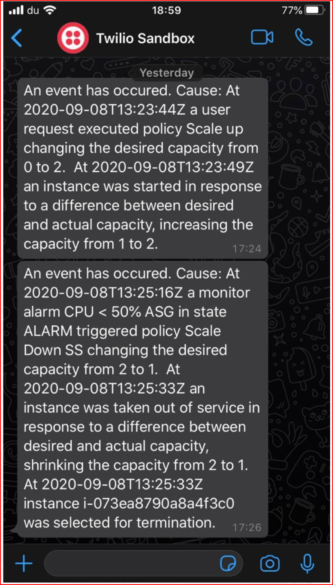

# Integration of Twilio WhatsaApp API to AWS lambda

## Purpose: Notification via AWS Lambda for Cloudwatch event of Auto Scaling events to trigger a WhatsApp notification
  - EC2 Launch and terminate will evoke events that will call Lambda and have a WhatsApp message sent to configured number

## Pre-requisites after cloning project:
  - Install serverless-python-requirements serverless plugin to ensure serverless knows of package requirements
  `serverless plugin install -n serverless-python-requirements`
    Note: Refer to requirements.txt file to see which packages are required for this project that are already stated (i.e. no changes needed in the requirements.txt file)
  - Set up Twilio account and have Account SID, Auth Token, 'from' number (i.e. Twilio sandbox number) and 'to' number      (i.e. subscribed receivers from sandbox)
  - Create a config.dev.json file under 'config' directory. Refer to config.template.json for format. Provide details from twilio account.   
  **IMPORTANT**: This file will contain sensitive information, hence is part of .gitignore  

  The below is an example of how it would look like:
  ```
  {
  "serverless": {
   "twilio_account_sid" : "ACsdr334sdd4ff34dsfd333dd3",
   "twilio_auth_token" : "34j4jh4jh43jkjh4495n55",
   "send_to_list" : "whatsapp:+131234567",
   "send_from" : "whatsapp:+1453245344" ,
   "profile": "profileCreatedByYou"
  }
  }
  ```

  - Create the profile to place in config.dev.json using below steps :

  Install the AWS CLI E.g. link available as of Jul 2020 is [here](https://docs.aws.amazon.com/cli/latest/userguide/install-cliv2-windows.html)  

  To create a profile name with name as, for E.g. 'awsautomate', run command below:   
  `aws configure --profile awsautomate`

  **Note**: The above command will require you to pass Key ID and private key to set up. To get this , you will need to create a user in AWS IAM console and set it up for programmatic access. Download the csv of private key credentials from the console (IMPORTANT: It is only provided at time of creation. If you accidentally missed it, delete the user and create a new one and keep the csv).    
  Use the contents of the csv to pass to command above.  

## Additional Pre-requisites for AutoScaling setup in serverless:

  - In my setup in AWS Console, I have 2 Autoscaling groups created , namely 'AWSAutomateASG' and 'SecondASG'  
  If you are not following same naming conventions, create ones with name of your choice and ensure this part of serverless.yml is updated.

  ```
  detail:
    AutoScalingGroupName:
      - "SecondASG"
      - "AWSAutomateASG"
  ```

  - OPTIONAL : If you wish to have the serverless setup done in a specific region, specify in provider section of serverless.yml. I have chosen ap-south-1


## Deploy project:
  - Run below in CLI in context of folder containing serverless.yml
  `serverless deploy`

## Testing steps:
  - Go to AWS console and create a policy to scale up and/or scale down to mock up an event of calling a scale up / down action manually.
  - Confirm if message is received on configured number.

## Outcome expected:

  
